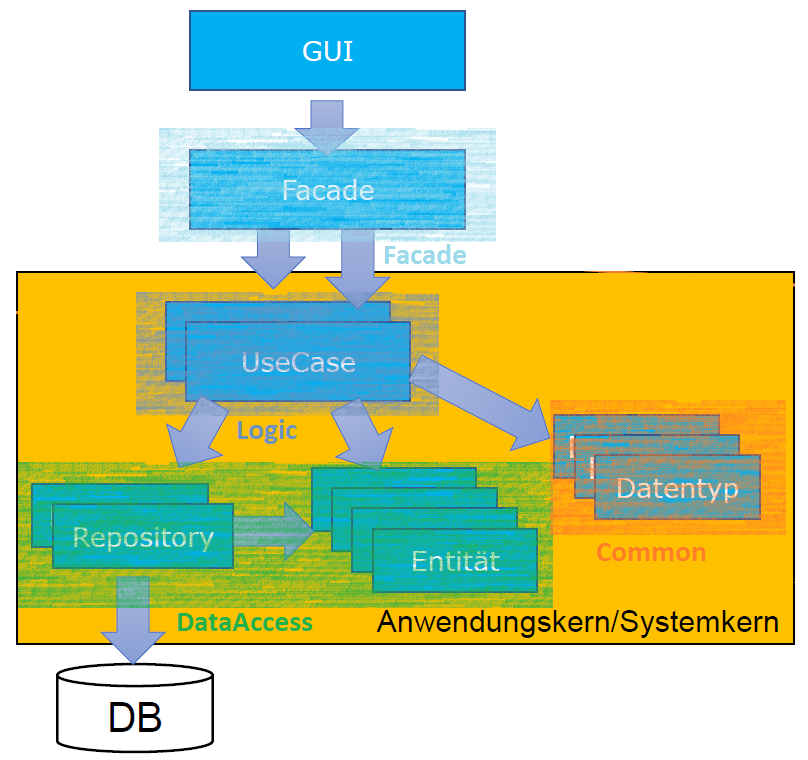

## **CRUD Kanban Board Web Application Demo**

**What is used:**
- Spring boot 2.7.2 on Java 17 (Backend)
- React (Frontend)

**Dependencies:**
- Rest Repositories (Exposing Spring Data repositories over REST via Spring Data REST)
- 
[//]: # (- Thymeleaf A modern server-side Java template engine)
- JPA (Persist data in SQL stores with Java persistence API using Spring Data and Hibernate)
- H2 Database (Fast in-memory database)
- Assertj (For convenient tests)

**Additional Tools:**
- Maven 3.8.6
- Node.js v16.17.0 (includes npm 8.15.0)
- NVM 1.1.9 (Node Version Manager - POSIX-compliant bash script to manage multiple active node.js versions)

**Project Environment:**
- Project SDK: openjdk-17 (java version "17")
- Project language level: 17 - Sealed types, always-strict floating-point semantics

**Architecture/Package structure:**
